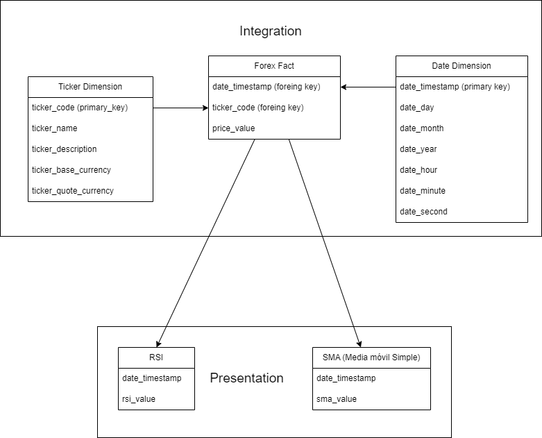
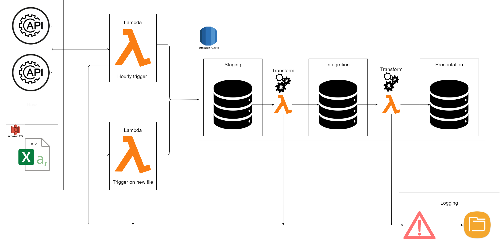

# Prueba Técnica

## Alcance del proyecto y captura de datos

### **Fuentes**
Para el desarrollo de la prueba, consideré utilizar un data set relacionado a los precios y volúmenes de pares en el mercado de divisas.

El dataset lo conseguí en este [link](https://www.kaggle.com/datasets/mathurinache/dukascopy-forex-tick-data-20082019). Este cuenta con 65 GB de información pero solamente seleccioné 2 archivos de dos pares de divisas (2 del EURUSD y 2 del GBPUSD) del año 2019.

Son archivos csv donde cada uno tiene un poco más de un millón de filas. Así, cada archivo se considerará como una fuente.

Como esta información es antigua, utilizaré adicionalmente estas API's relacionadas con el mismo tema.

Las fuentes serán:

- [Open Exchange Rates](https://openexchangerates.org/) (1000 request al mes)
- [Free Forex API](https://www.freeforexapi.com/) (Sin límite aparentemente)
- [Any API Currency](https://anyapi.io/currency-exchange-api) (500 request al mes)

Listo 3 API's pero posiblemente no se utilicen las 3, esto dependerá de como se comporte cada una a lo largo de las ejecuciones.
El principal limitante es la naturaleza de la información, ya que casi siempre estos tipos de datos requieren pago para que sean fiables.

La idea es que con los archivos csv se haga una carga inicial de muestra del pipeline y posteriormente se empezarán a consumir las API's para tener la información más actualizada.

### **Uso final**
Para este tipo de datos, las columnas disponibles y la categoría, voy a generar unas tablas de análisis.

Las tablas, por ahora, estarán relacionadas con indicadores técnicos de trading.

Se crearían dos tablas, una para una media móvil simple de 5 días y la segunda para un RSI (Relative Strength Index).

Estos indicadores en el día a día, permiten tomar decisiones de inversión sobre los activos o divisas.

Estos datos de los indicadores se pueden utilizar posteriormente para graficarse y así tomar las decisones.

---
## **Análisis Exploratorio de los Datos**
Los archivos contienen las siguientes columnas:
- UTC (fecha en formato '%Y-%m-%dT%H:%M:%S.%f%z')
- Ask Price
- Bid Price
- Ask Volume
- Bid Volume

En una exploración inicial por los archivos csv, encontré que el único problema es el formato de la fecha.

Se encuentra en UTC por lo que se debería hacerle una transformación inicial para ajustarlo a los campos del modelo.

Respecto a los otros campos no se encontraron inconsistencias pero sería necesario que los campos de los precios no estuvieran vacíos por lo que son insumo necesario en el cálculo de las tablas finales.

Para estandarizar el formato de fecha al modelo, se deberían seguir los siguientes pasos:

1. Leer el archivo csv ya sea con pandas o pyspark.
2. Crear un nuevo dataframe en base al handler del paso anterior, adicionando las columnas de timestamp, day, month, y year.
3. Obtener la columna específicamente del UTC con el comando respectivo para la librería utilzada.
4. Aplicar el método fecha = datetime.strptime(&lt;Fecha original&gt;, '%Y-%m-%dT%H:%M:%S.%f%z') donde el primer argumento es la fecha como str (String) y el segundo el formato en el cuál esta.
5. Aplicar el método fecha.timestamp y los atributos fecha.day, fecha.month, fecha.year para obtener los valores respectivos.
6. Guardar estos valores junto con los datos originales en el dataframe creado en el paso 2.

Respecto a los precios de Ask y Bid, sacaré un promedio con estos valores y las columnas de Volume se eliminarán.

---
## **Definir Modelo de Datos**
### **Modelo**

Es un modelo estrella sencillo que se ajusta a los datos porque no contienen más niveles de jerarquía después del ticker o la fecha.

Inicialmente consideré tener una tercera dimensión que se llamaría "Side Dimension", la cual contendría los valores y nombres para el tipo de precio (Bid y Ask), pero lo descarté porque me generaría llaves primarias duplicadas en la tabla de hechos para la dimensión de la fecha. Es decir, aparecería un date_timestamp para el ask y un date_timestamp para el bid, porque provienen de la misma línea en la fuente.

En el gráfico se distinguen las capas de Integration y Presentation.

### **Arquitectura**
Para este modelo, consideré tener 4 capas:
- Raw: Solamente aplicará para los archivos csv crudos como se obtuvieron del dataset.
- Staging: Consistirá de una base de datos donde se tendrán tablas separadas por fuente y por ticker.
    - Los datos de los archivos csv se cargarán a su respectiva tabla solamente eliminando las columnas del volúmen.
    - Los datos de las API's se cargarán a sus respectivas tablas, con la información como proviene de la respuesta al request.
- Integration: Se harán las primeras transformaciones para la limpieza de los datos:
    - Estandarización de las fechas.
    - Promedio de los precios bid y ask para las tablas provenientes de los csv.
- Presentation: Se harán las transformaciones y cálculos necesarios para obtener los indicadores mencionados en el [uso final](#uso-final). Esta será la capa final y la que estaría disponible para construir gráficos y ejecutar análisis para tomar las decisiones de inversión.

### **Modelo de arquitectura:**

Este diseño hará uso de los servicios de AWS.

Escogí estos servicios porque he trabajado con algunas de sus herramientas y no he usado el periodo de prueba aún.

Ahora, para cada una de las herramientas mostradas en el gráfico:

**El S3 de amazon** va a estar presente a lo largo de toda la arquitectura, debido a que esta herramienta funciona también de la mano con Aurora para el almacenamiento.

**Lambda es útil por ser un servicio Serverless** y facilita la ejecución del pipeline porque no tendré que preocuparme por el aprovisionamiento ni la administración de los servidores.

Adicionalmente, es posible ejecutarla automáticamente con eventos específicos, como el cambio de archivos en el S3 (agregarlos en este caso).

**Amazon Aurora** me parece que es una solución muy interesante por su compatibilidad con MySQL y PostgreSQL. Es autoescalable y se usa on-demand.

El primer del S3 uso será para recibir los archivos csv para la carga inicial (la capa *RAW*).

Luego, tanto para las API's como para los archivos csv, utilizaré una Lambda que me permita hacer un primer procesamiento de los datos.

Para las API's, se ejecutará la función Lambda cada hora donde se hará un request de los pares EURUSD y GBPUSD, obteniendo su precio en el momento junto con la fecha para ser guardado en la capa *Staging*.

Para los archivos csv, se ejecutará la función cada que aparezca un nuevo archivo en el Bucket.

Esta ejecución inicial no tiene ningún tipo de transformación ya que la idea es obtener la información y llevarla a una capa donde se pueda empezar a transformarla (ELT).

Una vez en la capa *Staging*, se hará la limpieza de los datos, extrayendo las fechas y los ticker para ajustar los datos al [modelo](#modelo), hacer las pruebas de calidad de los datos y luego llevarlos a la capa de *Integration*.

Por último, desde *Integration* se aplicarán las transformaciones finales para obtener los indicadores y llevar la información a *Presentation* para disponibilizarla.

En cualquiera de estos casos, siempre habrá una clase de Python que se encargará de registrar la ejecución del pipeline en un log, indicando cuales partes del proceso fueron exitosas y donde hubieron fallos.

### **Frecuencia de ejecución:**

El objetivo final del pipeline es poder consumir las API's y una de las fuentes restringe los request a 1 por hora, siendo la más restrictiva de las que escogí.

Debido a esto, considero que la frecuencia de ejecución del pipeline va a ser cada hora.

Este tiempo no afecta el [uso final](#uso-final) ya que una actualización por hora entrega una cantidad de datos muy útil para el cálculo de los indicadores.